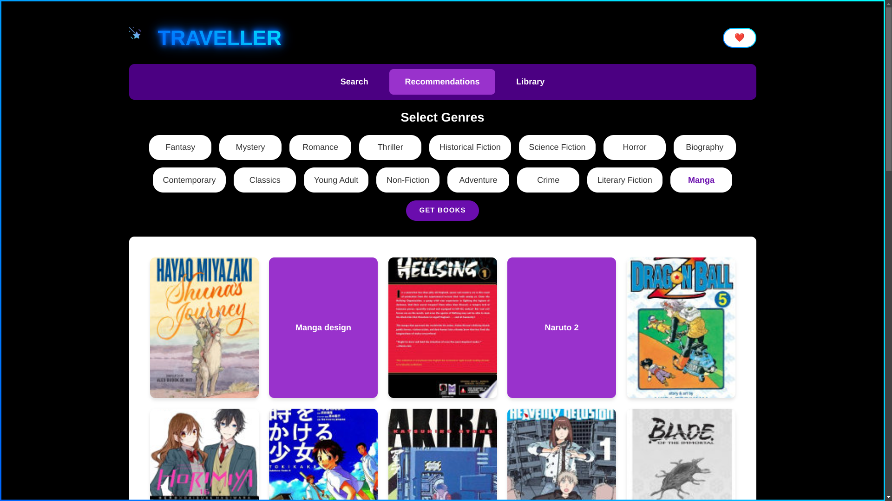

# 📚 Traveller - Book Tracking & Recommendation System

A modern web application for book enthusiasts to discover, track, and organize their reading journey. Built with vanilla JavaScript, this application offers a sleek interface to search books, get recommendations, and manage your personal library.



## ✨ Features

### 📖 Book Discovery
- **Search System**: Find books instantly using the Google Books API
- **Genre-based Recommendations**: Discover books by selecting from 16 different genres
- **Rich Book Details**: View comprehensive information including synopsis, author details, and ratings

### 📚 Library Management
- **Multiple Reading Lists**: Organize books into different categories:
  - Currently Reading
  - Completed
  - Favorites
  - Plan to Read
  - On Hold
- **Progress Tracking**: Monitor your reading journey with:
  - Pages read
  - Start/End dates
  - Personal ratings
  - Reading status updates

### 💫 User Experience
- **Modern UI**: Clean and intuitive interface with smooth animations
- **Responsive Design**: Seamless experience across all device sizes
- **Local Storage**: Persistent library data saved in your browser
- **Real-time Updates**: Instant feedback for all user interactions

## 🚀 Live Demo
[View Live Demo](https://yuji25.github.io/Book-Recommender-and-Library-Organizer) <!-- Add your deployed site link here -->

## 🛠️ Built With
- HTML5
- CSS3
- Vanilla JavaScript
- Google Books API
- LocalStorage API

## 🏃‍♂️ Getting Started

### Prerequisites
- Modern web browser
- Internet connection (for API calls)
- Google Books API key

### Installation
1. Clone the repository
   ```bash
   git clone https://github.com/Yuji25/Book-Recommender-and-Library-Organizer.git
   ```
2. Navigate to the project directory
   ```bash
   cd Book-Recommender-and-Library-Organizer
   ```
3. Open `index.html` in your browser or use a local server
   ```bash
   # Using Python
   python -m http.server 8000
   # Using Node.js
   npx http-server
   ```

### Configuration
1. Replace the API key in `script.js`:
   ```javascript
   const API_KEY = 'YOUR_GOOGLE_BOOKS_API_KEY';
   ```

## 🤝 Contributing
Contributions are welcome! Please feel free to submit a Pull Request.

1. Fork the project
2. Create your feature branch (`git checkout -b feature/AmazingFeature`)
3. Commit your changes (`git commit -m 'Add some AmazingFeature'`)
4. Push to the branch (`git push origin feature/AmazingFeature`)
5. Open a Pull Request


## 🙏 Acknowledgments
- Google Books API for providing book data
- Icons and images from Google <!-- Add your icon/image sources -->
